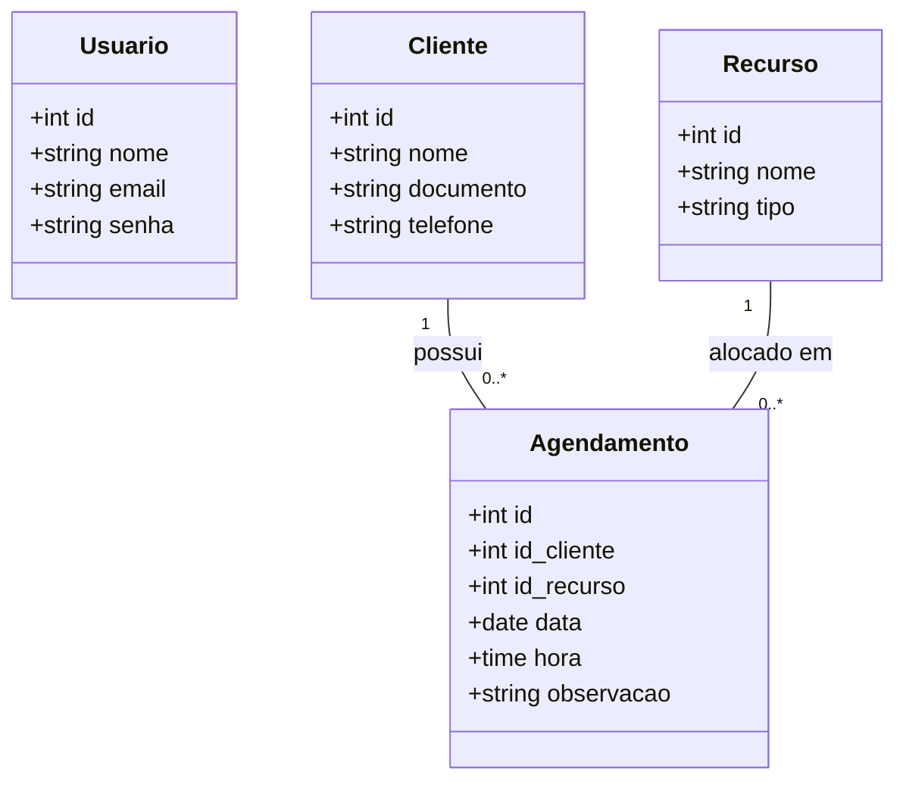

# Sistema de Agendamento Inteligente - Estúdio de Tatuagem e Piercing (SAEP)

## Contextualização
Você foi contratado como Desenvolvedor Fullstack por uma Software House que está lançando um novo produto no mercado: um Sistema de Agendamento Inteligente "White-Label". Esse sistema tem uma arquitetura base padronizada, mas é comercializado para diferentes nichos de mercado (clínicas, oficinas, estúdios, quadras esportivas, etc.).
O grande diferencial do sistema é acabar com as agendas de papel e planilhas confusas, prevenindo a sobreposição de horários (double-booking), que é a principal causa de prejuízos e reclamações nesses estabelecimentos.

## Desafio
Desenvolver a versão do sistema voltada para o nicho de mercado que lhe foi sorteado: Estúdio de Tatuagem e Piercing.
A arquitetura exigida é:
Frontend obrigatoriamente desenvolvido em Angular  
Backend (API) desenvolvido em linguagem/framework de sua escolha.
O sistema deve permitir ao usuário administrador cadastrar clientes, listar clientes e realizar agendamentos de serviços/recursos. O módulo de agendamento deve conter a seleção obrigatória do recurso/especialidade do seu tema. O sistema deve incluir um mecanismo de validação que emita um alerta automático caso haja tentativa de agendamento para o mesmo recurso (ex: médico, sala, quadra, elevador mecânico) no mesmo horário. O sistema deve registrar um histórico completo identificando a data, hora, cliente e recurso agendado.

## Escopo do Projeto

### 1. Introdução
Este documento especifica os requisitos de software para o sistema de agendamento inteligente voltado para um estúdio de tatuagem e piercing. Será desenvolvida uma aplicação web (Back-end em Java Spring Boot e Front-end em Angular) que permita a autenticação do usuário administrador, o gerenciamento (CRUD) de clientes e o registro de agendamentos de sessões. O sistema contará com um mecanismo de validação de horários, bloqueando automaticamente a sobreposição de agendamentos (double-booking) para um mesmo recurso, como macas ou tatuadores, e mantendo um histórico completo dos atendimentos.

## 1. Lista de Requisitos Funcionais
- **RF01:** O sistema deve permitir a autenticação (login) de usuários administradores.
- **RF02:** O sistema deve conter uma interface principal com exibição do usuário logado, botão de logout e menu de navegação.
- **RF03:** O sistema deve permitir cadastrar, editar, excluir e listar clientes.
- **RF04:** O sistema deve conter um campo de busca para filtrar clientes por nome ou documento.
- **RF05:** O sistema deve permitir o cadastro de agendamentos contendo Cliente, Data, Hora e Recurso (Maca/Tatuador).
- **RF06:** O sistema não deve permitir o agendamento de um mesmo recurso na mesma data e hora (Regra de Conflito).
- **RF07:** O sistema deve listar o histórico de agendamentos já realizados.

## 2. Diagrama Entidade Relacionamento (DER)

## 9. Casos de Teste de Software
| ID | Descrição | Passo a Passo | Resultado Esperado |
|---|---|---|---|
| CT01 | Login Válido | 1. Inserir email e senha corretos. 2. Clicar em Entrar. | Redirecionamento para a Interface Principal. |
| CT02 | Login Inválido | 1. Inserir email/senha incorretos. 2. Clicar em Entrar. | Exibir mensagem "Credenciais inválidas" na tela. |
| CT03 | Conflito de Agendamento (Double-booking) | 1. Acessar Agendamentos. 2. Criar agendamento para a "Maca 1" às 14:00 do dia 20/10. 3. Tentar criar outro agendamento para a "Maca 1" às 14:00 do dia 20/10. | O sistema deve bloquear a ação e exibir um alerta visual de erro. |
| CT04 | Busca de Cliente | 1. Acessar Clientes. 2. Digitar o nome de um cliente existente na busca. | A grid deve ser filtrada mostrando apenas o cliente pesquisado. |

## 10. Requisitos de Infraestrutura
- **Frontend:** Angular CLI (v16 ou superior), Node.js (v18+).
- **Backend:** Java 17 (ou superior), framework Spring Boot, Spring Web, Spring Data JPA, Maven ou Gradle.
- **Banco de Dados:** Postgres.
- **Sistema Operacional:** Windows 10/11, macOS ou Linux.